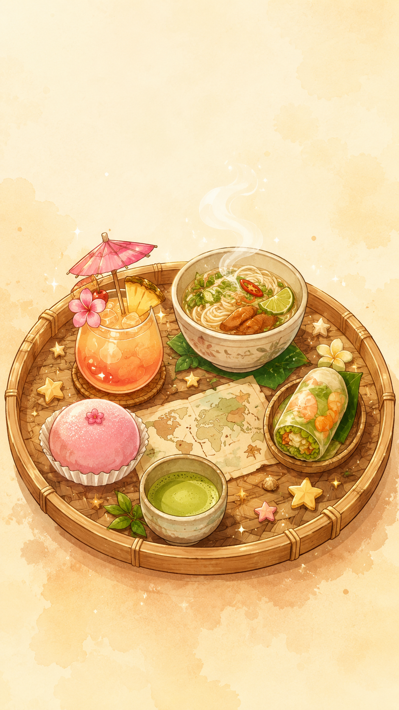

# 🍹 Mixology Merge

A cozy Suika-style merge game, built as a gift for Mai. Shoot drinks onto a
bar table, merge matching pairs into bigger and better drinks, and try not to
let the table overflow.

**▶ Play it in your browser:** https://mikaelandblom-coder.github.io/Drink-merge-game/

<p align="center">
  
</p>

## How to play

- **Aim and release** to shoot a drink onto the table.
- **Two drinks of the same kind merge** into the next tier — bigger drink, more coins.
- Higher tiers pay more, and chaining merges quickly can multiply your score
  (with **Combo multipliers** on).
- If the pile spills back past the danger line, the bar closes — **game over**.
- Your score is your coin total; each map keeps its own local high-score board.

## Maps

A world tour of flavours — each map has its own art, drink chain, music, and
sound theme:

| Map | Theme |
|---|---|
| Hawaii | Tiki Bar |
| Saigon | Pho House |
| Kyoto | Night Market |
| Mage Tower | Arcane Sanctum |
| Plushie Factory | Made for Mai |
| Melody Lane | Music Shop |

## Game modes

- **Combo multipliers** — fast successive merges stack a score multiplier.
- **Happy Hour** — customers queue up behind the bar and order drinks off your
  table. Serve them for coins, then merge the receipts they leave behind into
  a golden payout.
- **Large table** — some maps offer a bigger play area with its own high-score
  board.

## Running locally

No build step — it's vanilla JS served as static files:

```
python -m http.server 5500
```

Then open http://localhost:5500.

## Tech

- [Matter.js](https://brm.io/matter-js/) — 2D physics (top-down, gravity off)
- Canvas 2D — perspective-rendered table, drinks, particles
- Web Audio API — all sound effects are synthesised, zero audio files for SFX
- Python + Pillow + NumPy — asset pipeline for the AI-generated art

Made with ❤️ for Mai.
